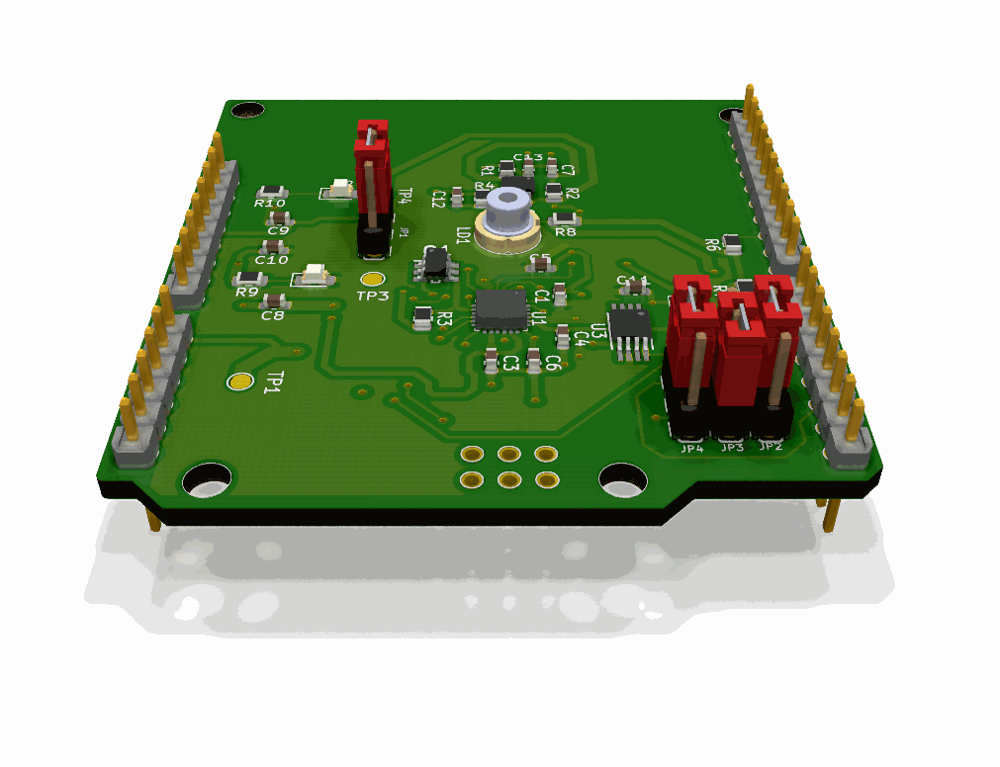

The implementation chosen is self mixing interferometry as the diode lasers were readily available therefore provided a good starting point to the approach chosen 
of self mixing interferometry. Includes design of a CW diode LASER driver, 
a transimpedance amplifier on the Photodiode section of the TO-18 laser diode with a -3dB cutoff of 200 kHz, 
an output high pass filter and the relevant control circuitry that allows the whole system to be tested and controlled with industry standard 32 bit, 
arduino form factor development boards such as the FREEDOM© series from NXP or the DISCOVERY© and NUCLEO© series from STMicroelectronics among others.

## References
- [Original project by Kiogora](https://github.com/Kiogora/interferometer)
  - [Whitepaper](https://github.com/aleksas/interferometer/raw/master/documents/Laser_diode_modulation.pdf)